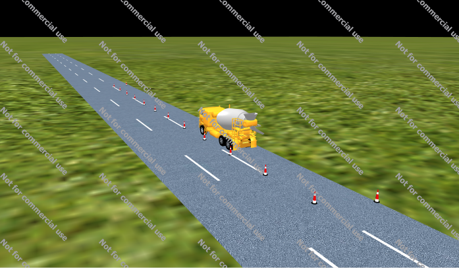
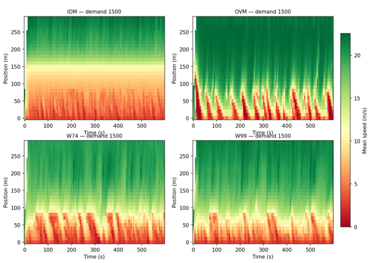

# TESS NG Car-Following Model Benchmark Dataset

> **Behavioral Fidelity of Built-in Car-Following Models in TESS NG Microsimulation: A Controlled Work-Zone Bottleneck Characterization**
> Laughter, E. S. (2026) · *Preprint*

[](https://creativecommons.org/licenses/by/4.0/)

---

## Overview

This repository holds the **trajectory dataset** and **structured manifest** produced by the study:

> **Laughter, E. S. (2026).** *Behavioral Fidelity of Built-in Car-Following Models in TESS NG Microsimulation: A Controlled Work-Zone Bottleneck Characterization.* Preprint. [ResearchGate](https://www.researchgate.net/publication/412751354_Behavioral_Fidelity_of_Built-in_Car-Following_Models_in_TESS_NG_Microsimulation_A_Controlled_Work-Zone_Bottleneck_Characterization)

The study evaluates the **four car-following models built into TESS NG** — IDM, OVM, Wiedemann 74 (W74), and Wiedemann 99 (W99) — at their **default out-of-box parameters**, using a controlled three-lane work-zone bottleneck. Trajectories are the raw output of each simulation run and are suitable for downstream analysis including capacity estimation, surrogate safety assessment, behavioral fingerprinting, and clustering.

---

## Dataset

### Scope

| Property | Value |
|---|---|
| Simulator | TESS NG |
| Scenario | Work-zone bottleneck — 3-lane, 300 m link; middle segment of lane 3 temporarily closed |
| Vehicle type | Passenger car only |
| Run duration | 600 s per run |
| Sampling interval | ~33 ms (~30 Hz) |
| Demand levels | 100, 200, 300, 400, 500, 650, 900, 1500 veh/h |
| Random seeds | 10, 300 |
| Total runs | **64** (64 cells in the 4 × 8 × 2 factorial design) |
| Valid runs after QC | **51** |
| Total size | ~1.4 GB |

### Car-Following Models

| Model | Family | Notes |
|---|---|---|
| **IDM** | Continuous acceleration | Intelligent Driver Model |
| **OVM** | Optimal velocity | Optimal-Velocity Model |
| **W74** | Psychophysical | Wiedemann 74 — urban-oriented |
| **W99** | Psychophysical | Wiedemann 99 — freeway-oriented |

### Trajectory Schema

Each trajectory file (`Trajectory_vehicle_trajectory.csv`) contains one row per vehicle-timestep with these columns:

```
Time(ms)  Vehicle ID  X(m)  Y(m)  Z(m)
Current Speed(m/s)  Current Acceleration Speed(m/s²)
Angle  Lane Angle  Travel Distance(m)  Current Road Traveled Distance(m)
Road ID  Link/Connector
Lane ID/Upstream Lane ID_Downstream Lane ID
Lane Number/Upstream Lane Number_Downstream Lane Number
```

- Time is in **milliseconds** from simulation start.
- Positions are in **metres** (local simulation coordinates).
- Speed is in **m/s**, acceleration in **m/s²**.
- A negative `Current Acceleration Speed` indicates braking.

### Quality Control

A run is marked **valid** (`qc.complete = true`) only when:

1. **Span gate** — the run starts at ≤ 10 s and ends at ≥ 590 s (the full 600 s was exported, no head/tail truncation).
2. **Density gate** — median per-vehicle frame coverage ≥ 0.85 (no mid-run data thinning detected).

Out of 64 runs, **51 are valid**. See `dataset.json` → `runs[].qc` for per-run QC flags.

---

## Data Files

### `dataset.json` — Primary Manifest *(start here)*

The authoritative manifest. Open it in any text editor or load it programmatically. Top-level structure:

```json
{
  "huggingface_url": "...",   ← point this to your HF dataset after upload
  "study":       { ... },     — citation metadata
  "simulation":  { ... },      — experimental design summary
  "dataset":     { ... },      — QC summary
  "runs": [                     — one entry per run (all 64)
    {
      "model":      "IDM",
      "volume":     100,
      "seed":       10,
      "run_folder": "IDM_10_100",
      "trajectory": "IDM_10_100/Trajectory_vehicle_trajectory.csv",
      "qc": {
        "complete":    true,
        "n_vehicles":  100,
        "rows":        51506,
        "size_mb":     5.15,
        "duration_s":  599.3,
        "speed_mean":  17.06,
        "dt_ms":       33.0,
        "density":     0.99,
        "id_coverage": 1.0
      }
    },
    ...
  ]
}
```

### `dataset_profile.csv`

Machine-readable QC table in tabular format. Columns: `model`, `volume`, `seed`, `complete`, `n_vehicles`, `rows`, `size_MB`, `duration_s`, `speed_mean`, `dt_ms`, `density`, `id_coverage`.

---

## Downloading the Trajectory Files

> **The trajectory CSV files are too large to store directly in this GitHub repository.**  
> They are hosted on **Hugging Face** and downloaded separately.

### Step 1 — Update the URL

After uploading the trajectory files to Hugging Face, open `dataset.json` and set:

```json
"huggingface_url": "https://huggingface.co/datasets/YOUR-USERNAME/tess-ng-car-following"
```

### Step 2 — Download with the Hugging Face CLI

```bash
# Install the Hugging Face hub library
pip install huggingface_hub

# Log in (creates ~/.cache/huggingface/token)
huggingface-cli login

# Download the full dataset to ./data/
huggingface-cli download \
  --repo-type dataset \
  --local-dir ./data \
  YOUR-USERNAME/tess-ng-car-following
```

Or download a single run's trajectory file:

```bash
huggingface-cli download \
  --repo-type dataset \
  --local-dir ./data \
  YOUR-USERNAME/tess-ng-car-following \
  IDM_10_100/Trajectory_vehicle_trajectory.csv
```

### Step 3 — Verify with `dataset.json`

```python
import json, os

with open("dataset.json") as f:
    meta = json.load(f)

local_base = "./data"
missing = []
for run in meta["runs"]:
    if run["qc"]["complete"]:            # only check valid runs
        rel_path = run["trajectory"]     # e.g. "IDM_10_100/Trajectory_vehicle_trajectory.csv"
        full_path = os.path.join(local_base, rel_path)
        if not os.path.exists(full_path):
            missing.append(rel_path)

if missing:
    print(f"Missing {len(missing)} files")
    for p in missing:
        print(" ", p)
else:
    print("All valid run trajectories present.")
```

---

## Quick-Start Analysis Example

```python
import pandas as pd
import json

with open("dataset.json") as f:
    meta = json.load(f)

# Select all complete OVM runs at demand = 1500 veh/h
target_runs = [
    r for r in meta["runs"]
    if r["model"] == "OVM" and r["volume"] == 1500 and r["qc"]["complete"]
]

# Load the first seed
run = target_runs[0]
df = pd.read_csv(f"data/{run['trajectory']}")
print(f"{run['model']}  vol={run['volume']}  seed={run['seed']}")
print(f"  {run['qc']['n_vehicles']} vehicles, {run['qc']['rows']:,} rows")
print(f"  mean speed: {df['Current Speed(m/s)'].mean():.2f} m/s")
```

### Speed–Spacing Phase Plane

```python
import matplotlib.pyplot as plt

df = pd.read_csv("data/IDM_10_100/Trajectory_vehicle_trajectory.csv")
speed  = df["Current Speed(m/s)"]
travel = df["Travel Distance(m)"]

# Space = cumulative travel distance; spacing ≈ gap + vehicle length
# (gap derivation requires leader-follower pairing — see paper Section 3.5.3)
plt.figure(figsize=(6, 4))
plt.hexbin(travel, speed, gridsize=60, cmap="YlOrRd")
plt.xlabel("Cumulative travel distance (m)")
plt.ylabel("Speed (m/s)")
plt.title("IDM — Seed 10 — 100 veh/h")
plt.colorbar(label="count")
plt.tight_layout()
plt.savefig("phase_plane_IDM.png", dpi=150)
plt.show()
```

---

## Regenerating `dataset.json`

If you add new runs, re-run `build_dataset_json.py` from the `.tess` root:

```bash
cd Net001-Copy.tess
python build_dataset_json.py
```

Requires: `pandas`.

---

## Citing This Dataset

Please cite both the paper and this repository:

**Paper:**
```
Laughter, E. S. (2026). Behavioral Fidelity of Built-in Car-Following Models in
TESS NG Microsimulation: A Controlled Work-Zone Bottleneck Characterization.
Preprint. Available at: https://www.researchgate.net/publication/412751354
```

**This repository (dataset):**
```
Laughter, E. S. (2026). TESS NG Car-Following Model Benchmark Dataset.
Computer simulation trajectory data [Data set and manifest].
https://github.com/code-studios/tess-ng-car-following
```

A ready-to-use `.cff` citation file is included in this repository.

---

## License

**CC BY 4.0** — You are free to share and adapt this material for any purpose, provided you give appropriate credit to the author.

[](https://creativecommons.org/licenses/by/4.0/)

## Network and results figures



*Road schematic of the 300 m three-lane link with the temporary lane-3 closure
forming the bottleneck. The scenario is deliberately minimal so that differences
in outcome are attributable to the CF model rather than network complexity.*



*Space-time speed fields by model under high demand, illustrating differing
congestion regimes across the four built-in car-following models - IDM
(continuous acceleration), OVM (continuous, optimal-velocity) and the two
psychophysical Wiedemann models (W74 urban-oriented, W99 freeway-oriented).*

## Getting started

A self-contained Python walkthrough that downloads and reads the dataset is
included in [`guides/`](guides/):

```bash
pip install huggingface_hub pandas
python guides/tess_ng_cfm_demo.py
```

See [`guides/README.md`](guides/README.md) for full instructions.

## Software credit

All simulations were run in [TESS NG](https://www.jidatraffic.com/home), the
microscopic traffic simulation software developed by **Shanghai Jida Traffic
Technology Co., Ltd. (Shanghai Jida Traffic Technology Co., Ltd.)**. The
simulation software itself is Jida Traffic's work. The analysis, dataset
curation, manuscript, and figures are the work of **Eni Solomon Laughter**,
Chang'an University.

